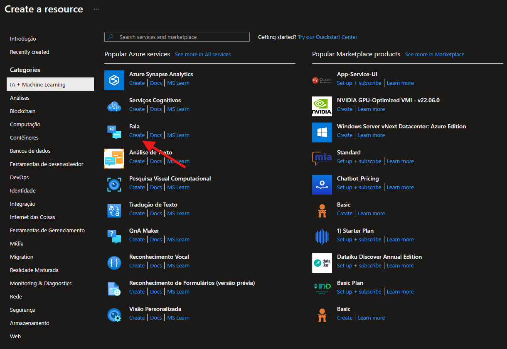
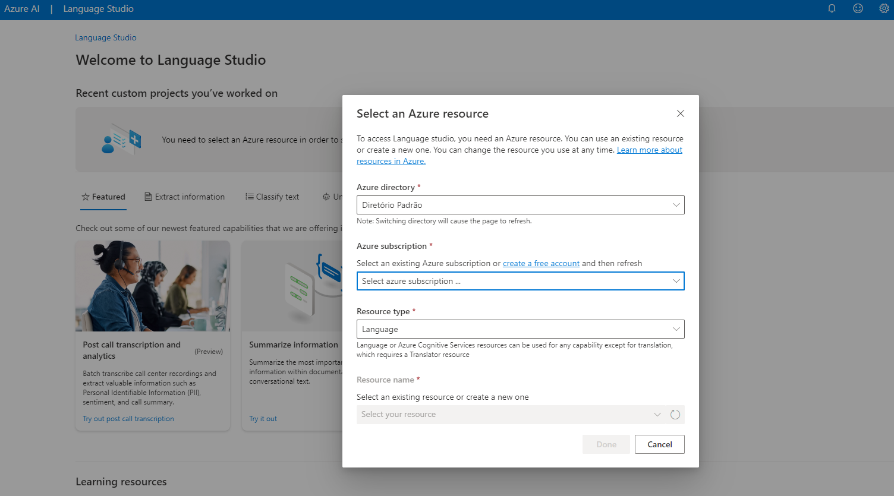
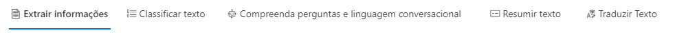
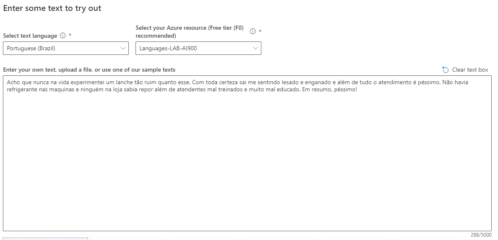
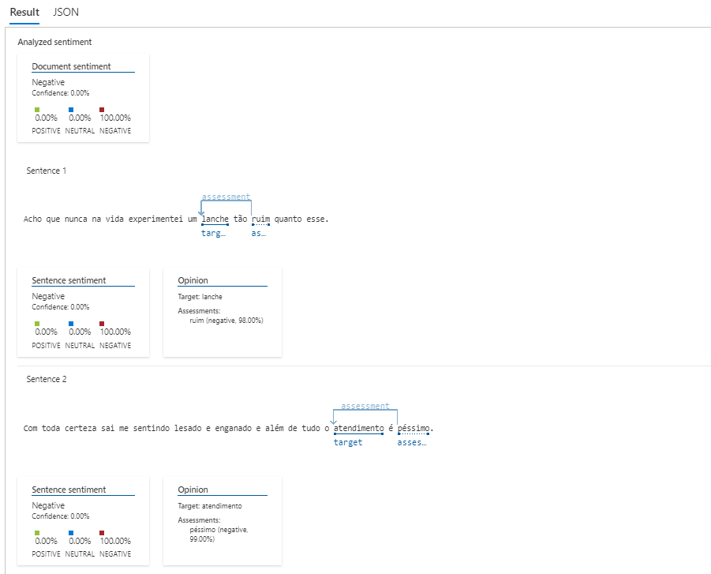
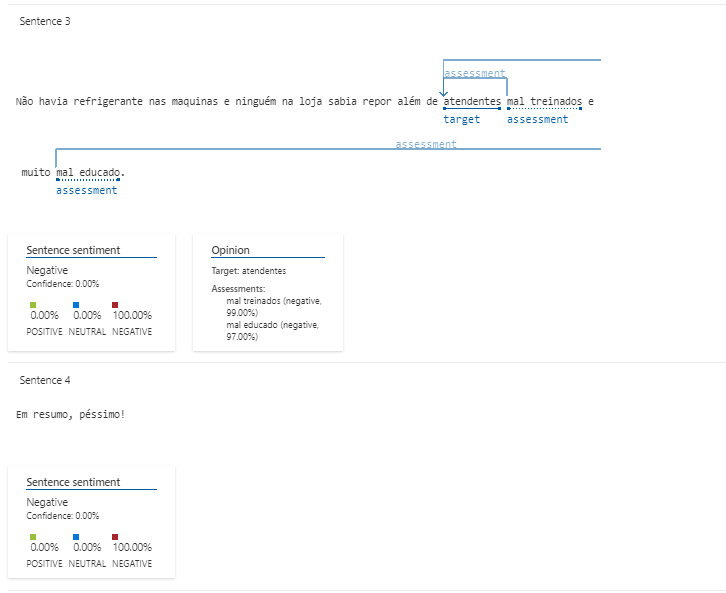
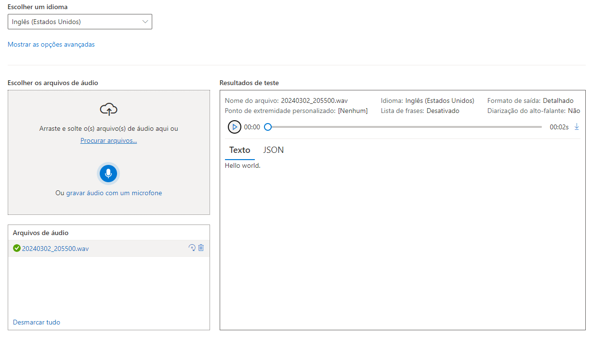

# Azure Language Studio
Análise de Imagem com o AI Vision Service da Microsoft.

O Azure AI Vision Studio é uma plataforma robusta da Microsoft Azure que facilita a criação, treinamento e implementação de modelos de visão computacional. Ela proporciona um ambiente unificado com diversas ferramentas e funcionalidades que simplificam o processo de desenvolvimento de soluções de IA focadas em visão computacional.

A Linguagem de IA do Azure é um serviço baseado em nuvem que fornece recursos de NLP (Processamento de Linguagem Natural) para entender e analisar texto. Use esse serviço para ajudar a criar aplicativos inteligentes usando o Language Studio baseado na Web, APIs REST e bibliotecas de clientes.

# Azure Speech Studio

O serviço de Fala fornece capacidades de reconhecimento de fala e de conversão de texto em fala com um recurso de Fala. Você pode transcrever o reconhecimento de fala com alta precisão, produzir vozes com sonoridade natural para conversão de texto em fala, traduzir áudio falado e usar o reconhecimento de locutor durante conversas.

## Instruções📕

### Crie um recurso no Portal Azure

1 - Acesse o [Portal Azure](https://portal.azure.com/).

2 - Faça login com sua conta Azure/Microsoft.

3 - Procure a opção "Criar um Recurso" e selecione "AI + Machine Learning"

4 - Selecione a opção Análise de Texto e criar

Imagem

ㅤ

5 - Selecione algo customizado caso queira, eu não irei customizar, então irei apenas continuar e criar o meu recurso.

6 - Preencha os campos, marque a caixinha e depois clique em  Revisar + Criar, confira as informações e crie.

7 - Espere finalizar a implantação, assim que concluída vamos para o próximo passo.

### Language Studio

1 - Acesse o [Portal do Language Studio](https://language.cognitive.azure.com/).

2 - Caso seja necessário logue com sua conta novamente.

3 - Preencha as informações pedidas:

Imagem

ㅤ

4 - Selecione o serviço que você deseja:

As opções são: Extração de informações, Classificação de Texto, Compreender perguntas e linguagem conversacional, Resumir texto e Traduzir texto.

Eu irei selecionar **"Classificar Texto"** e depois **"Análise de Sentimentos"**.

5 - Analyze sentiment and opinions, selecione a linguagem desejada e o recurso.

6 - Em seguida marque a caixinha de seleção e inicie, o texto será organizado por sentenças e haverá uma marcação indicando o sentimento, se foi negativo ou positivo:

### Speech Studio

1 - Acesse o [Portal do Speech Studio](https://speech.microsoft.com/portal). 

2 - Selecione um dos serviços disponíveis:

- Recursos de fala por situação

    Explore, teste e veja um exemplo de código para alguns dos casos de uso comuns usando recursos dos Serviços de Fala do Azure, como a conversão de fala em texto e a conversão de texto em fala.
- Conversão de fala em texto
    
    Transcreva com rapidez e precisão em mais de 100 idiomas e dialetos. Aumente a precisão de suas transcrições criando um modelo de fala personalizado que pode lidar com a terminologia específica de um domínio, ruído de fundo e sotaques.
- Conversão de texto em fala

    Crie aplicativos e serviços que falam com naturalidade, utilizando mais de 400 vozes em 140 idiomas e dialetos. Crie uma voz personalizada para diferenciar sua marca e use vários estilos de fala para incorporar uma sensação emocional ao seu conteúdo falado.
- Assistente de voz

    Enriqueça seu aplicativo ou sua experiência com uma interface por conversa para ativar e controlar seu produto.

3 - Selecionei na parte de conversão de fala em texto na opção **Conversão de fala em texto em tempo real**.

4 - Selecionei inglês e gravei um áudio, em seguida meu áudio foi convertido em texto.

### Próximos Passos
Ao final de cada Experimento tem artigos/tutoriais explicando como seria feita a integração de cada um dos elementos/recursos citados a cima.

## Conclusão

Finalizo aqui a explicação sobre os serviços do Azure Speech Studio e Language Studio.
